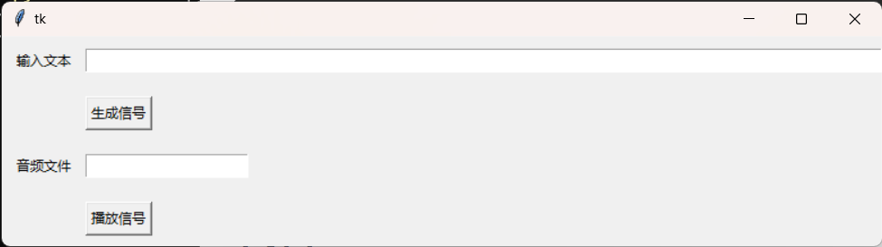
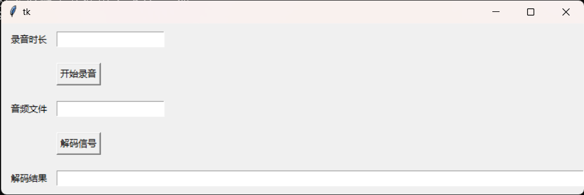

# SonicComm

## 项目说明

声波信号通信，具体见`doc/声波信号通信.pdf`

## 项目结构

```
SonicComm
├─ README.md
├─ doc
│    ├─ assets          # 图片资源
│    ├─ report.md       # 项目报告
│    └─ 声波信号通信.pdf  # 作业要求文档
└─ src
    ├─ fsk.py
    ├─ pkt.py
    ├─ readme.md        # 源码说明
    ├─ receiver.py      # 接收方
    ├─ requirements.txt # 环境依赖
    ├─ sender.py        # 发送方
    └─ utils.py
```

## 环境配置

Python 3.11.7

进入src目录，根据requirements.txt安装依赖包

```bash
$ pwd
~/SonicComm
$ cd src
$ pwd
~/SonicComm/src
$ pip install -r requirements.txt
```

## 发送方

```bash
$ python sender.py
```



输入文本后点击生成信号，会自动生成一个名为sender.wav的音频文件，并自动将音频文件栏自动填充为sender.wav

此时你可以点击播放信号就会播放音频，你也可以手动使用电脑自带的音频播放器播放wav文件

## 接收方

```bash
$ python receiver.py
```



输入录音时长（单位：秒），然后点击开始录音，录音结束后将自动保存为receiver.wav，并将音频文件栏自动填充为receiver.wav

此时点击解码信号即可看到结果

当然你也可以输入别的音频文件名，然后点击解码

## 调试

调试主要是将解调的中间过程显示出来，比如解调得到的01信号，希尔伯特滤波之后得到的包络波形等

```bash
$ python pkt.py --debug True
```

你可以自行修改pkt.py中main入口的代码
