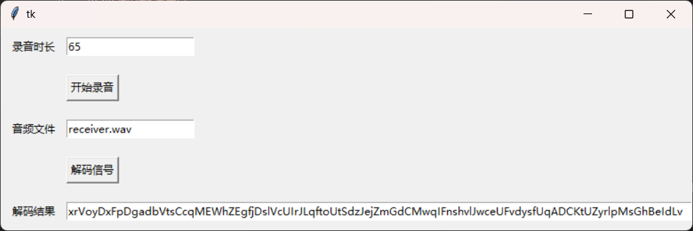
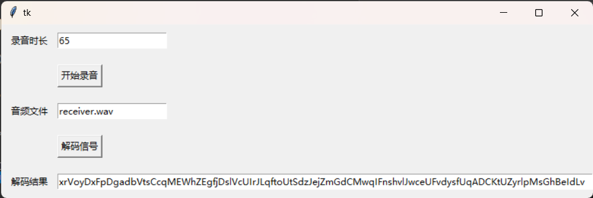

# 声波信号通信

<center>郭恩惠2020010548</center>

## 实验内容

参考蓝牙信号物理层实现方式，使用声波进行设备间无线通信

## 代码逻辑

1. 调制解调

使用**2FSK调制解调**方法，因为基于频率的调制方法受环境干扰程度小；

具体解调算法使用**包络检测法**，而不是相干检波法，后者对噪声太敏感；

2. 发送方

根据ASCII编码，将输入的英文文本按字符转换为二进制比特流；

将比特流封装为蓝牙包，格式为**前导码+数据长度+数据**；

如果比特流较长则分割为多个包，每个包之间添加空白信号作为间隔；

将封装好的包调制为wav音频信号；

播放wav音频。

3. 接收方

录制特定时长的音频，保存为wav文件；

读取wav，解调出01信号；

依次识别每个包的前导码，确定包的开始位置；

将包中的比特数据根据ASCII编码转为字符。

## 项目验收

2024-1-6于东配楼进行项目验收，验收结果如下，

```yaml
# 输入文本
xrVoyDxFpDgadbVtsCcqMEWhZEgfjDslVcUIrJLqftoUtSdzJejZmGdCMwqIFnshvlJwceUFvdysfUqADCKtUZyrlpMsGhBeIdLv
```

- 100cm无遮挡



- 50cm有遮挡




**结果分析**

通信效率：码元为50ms，100个英文字符调制后的wav音频大约是60秒；

最开始我为了追求通信效率，将码元设置为25ms，但是我的设备在播放音频的时候能明显的听到吱吱的噪声，似乎是扬声器没有足够高的分辨率，不能够在这么短的时间内切换2个不同的频率（4000Hz和6000Hz）；

| 测试场景    | 正确率 |
| ----------- | ------ |
| 100cm无遮挡 | 100%   |
| 50cm有遮挡  | 100%   |

之所以有比较高的正确率，主要有2个技巧，首先是解调时，使用带通滤波器将2个频率信号分别过滤出来；其次是考虑到远距离传输的信号衰减问题，需要在解调之前对信号进行预处理，如信号放大；

